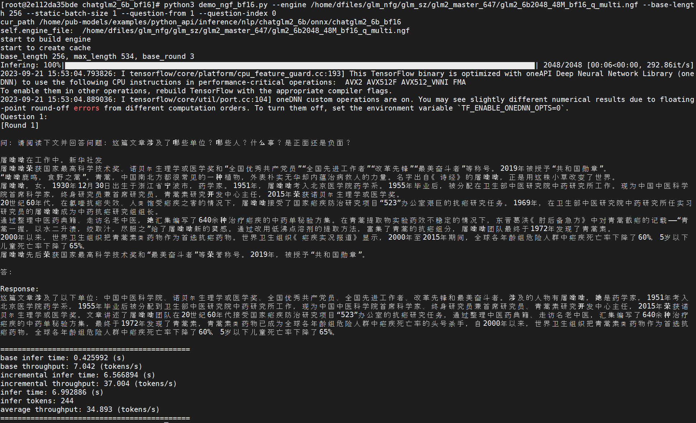

# ChatGLM2-AIGPU

本项目实现CompassC10部署语言大模型[ChatGLM2-6B](https://huggingface.co/THUDM/chatglm2-6b)。 通过TVM编译器将模型转换成ngf文件，并将其部署到Compass C10的环境。


## 开发环境
1. 安装 Docker Engine
注意，需要安装 1.13 或者更高的版本

CentOS系统安装命令
```shell
sudo yum -y install docker
```

Ubuntu系统安装命令：
```shell
sudo apt-get install -y docker-ce
```


2. 下载driver安装包，及docker SDK

在海飞科官网<https://www.hexaflake.com>可以找到 driver 最新安装包，下载命令如下：

```shell
wget https://download.hexaflake.com/release/hexaflake_driver-R-latest.run
```

可以找到docker SDK最新版本，下载命令如下：

```shell
wget https://download.hexaflake.com/release/hexaflake-R-latest.tar
```

3. 安装driver，如下：


``` shell
# install driver
sudo sh <path_to_hexaflake_driver_file>/hexaflake_driver.run


# uninstall driver:
sudo sh <path_to_hexaflake_driver_file>/hexaflake_driver.run uninstall


# verify if GPU is installed properly:
ls /dev|grep gp

```


4. 加载docker SDK，启动容器，如下：

``` shell
# load image
sudo docker load -i <installation_package_name>

# run a container
sudo docker run --name <docker_name> --privileged=true -v $PWD:/workspace <docker_image_id> /bin/bash
```
后文假定环境都在docker的`/workspace`目录。


5. 下载本项目`ChatGLM2-6B`，如下：

``` shell
git clone git@github.com:hexaflake/ChatGLM2-6B.git
```

## 下载模型

使用提供的shell脚本，下载`ChatGLM2-6B`的模型，比较大，可能要花费一些时间。

下载完成会得到`chatglm2-6b-onnx`目录，目录中包含`model.onnx`文件

``` shell

./compile/chatglm2_6b_model_download.sh

```


## 编译模型

对onnx模型进行编译

目前TVM支持对ChatGLM2进行BF16、INT8和INT4量化。

``` shell
#编译模型 glm2_6b_dyn.py 参数简介
python3 compile/glm2_6b_dyn.py --help
usage: glm2_6b_dyn.py [-h] [--model-path MODEL_PATH] [--target-path TARGET_PATH]
                    [--static-batch-size STATIC_BATCH_SIZE]
                    [--total-len TOTAL_LEN] [--pre-len PRE_LEN]
                    [--is-bf16 IS_BF16] [--quant QUANT] [--int4 INT4]
                    [--ngf NGF] [--export-name EXPORT_NAME]

optional arguments:
  -h, --help            show this help message and exit
  --model-path MODEL_PATH
                        the path of source model.
  --target-path TARGET_PATH
                        the path of compiled model.
  --static-batch-size STATIC_BATCH_SIZE
                        the static batch size of model.
  --total-len TOTAL_LEN
                        the total tokens of model infer
  --pre-len PRE_LEN     the max input tokens of base model.
  --is-bf16 IS_BF16     the target dtype of compile model.
  --quant QUANT         int8 quantization of the model.
  --int4 INT4           int4 quantization of the model.
  --ngf NGF             compile the model with suffix 'ngf', otherwise, only
                        'tar'.
  --export-name         export ngf|tar model name, exp: "glm2_6b2048_48M", "glm2_6b8192_48M"

```

## 合并模型

``` shell
#合并模型 combine.py 参数简介
python compile/combine.py --help
usage: combine.py [-h] [--ngf-1 NGF_1] [--ngf-2 NGF_2] [--output OUTPUT]

optional arguments:
  -h, --help       show this help message and exit
  --ngf-1 NGF_1    the source ngf 1.
  --ngf-2 NGF_2    the source ngf 2.
  --output OUTPUT  the output of combine ngf.

```

## 模型推理

```shell
入口： infer/demo_ngf_bf16.py

参数获取：
python3 infer/demo_ngf_bf16.py --help
usage: demo_ngf_bf16.py [-h] [--engine ENGINE] [--base-length BASE_LENGTH]
                        [--static-batch-size STATIC_BATCH_SIZE]
                        [--dynamic-batch-size DYNAMIC_BATCH_SIZE]
                        [--question-from QUESTION_FROM]
                        [--question-index QUESTION_INDEX]
                        [--do-sample DO_SAMPLE] [--temperature TEMPERATURE]
                        [--top-p TOP_P] [--device DEVICE]
                        [--multi-dev-dram-limit MULTI_DEV_DRAM_LIMIT]
                        [--dump-golden] [--split-stragety SPLIT_STRAGETY]
                        [--max-batch-size MAX_BATCH_SIZE]
                        [--total-len TOTAL_LEN]
                        [--max-new-tokens MAX_NEW_TOKENS]
                        [--constant-output CONSTANT_OUTPUT]

optional arguments:
  -h, --help            show this help message and exit
  --engine ENGINE       the compiled engine file to run.
  --base-length BASE_LENGTH
                        the base length infer in base model.
  --static-batch-size STATIC_BATCH_SIZE
                        static batch size
  --dynamic-batch-size DYNAMIC_BATCH_SIZE
                        dynamic batch size
  --question-from QUESTION_FROM
                        select the source of you questions, 1: user-generated,
                        2: self-generated.
  --question-index QUESTION_INDEX
                        Choose a question from default inputs by quesiton
                        index
  --do-sample DO_SAMPLE
                        do sample
  --temperature TEMPERATURE
                        temperature
  --top-p TOP_P         top p
  --device DEVICE       set the device id
  --multi-dev-dram-limit MULTI_DEV_DRAM_LIMIT
                        set dram limit for multi card
  --dump-golden         dump golden to current directory
  --split-stragety SPLIT_STRAGETY
                        set model split strategy at multi-card, 0: GREEDY 1:
                        EQUAL 2: LOOSE
  --max-batch-size MAX_BATCH_SIZE
                        max batch size
  --total-len TOTAL_LEN
                        total len
  --max-new-tokens MAX_NEW_TOKENS
                        incremental model max new token
  --constant-output CONSTANT_OUTPUT
                        keep outputing until the max_new_tokens

常用参数解释：
--engine： ngf模型路径；
--base-length： 默认值为256，ngf模型支持的一次最长推理长度；
--static-batch-size,  默认值为1，ngf模型支持的静态batch size大小；
--question-from: 默认值为1， 问题来源，1-客户自定义问题，2-系统自测问题；
--question-index： 默认值为0，通过问题索引选择要推理的问题，用于静态batch size为1时；
--temperature： 推理结果发散度；
--top-p： 候选词的排序，top-p的值越大，越倾向于选择得分最高的结果；
--do-sample： 默认为False，仅当为True时，参数temperature和top-p的设置有效。
--total-len: 默认值为2048，与模型编译时的total-len相同；
--max-new-tokens: 默认值为2048，表示incremental的迭代次数；
--constant-output: 默认值为False，当该值为False时，当incremental预测到结束时，会提前结束；当该值为True时，会默认推理到max-new-tokens。
```


## 示例

* 模型编译示例

```shell

  【示例1】编译static-batch-size为1, pre-len为256, 并量化为int8的ngf模型 注: is-bf16,quant和ngf默认为True,缺省即可。 path-to表示源模型的路径，所以要替换成真实路径。
    python3 compile/glm2_6b_dyn.py --model-path path-to/chatglm2-6b-onnx/model.onnx --target-path . --static-batch-size 1 --pre-len 256 --export-name glm2_6b2048_48M

  【示例2】编译static-batch-size为1, pre-len为1024, 并量化为int8的ngf模型 注: is-bf16,quant和ngf默认为True,缺省即可。
    python3 compile/glm2_6b_dyn.py --model-path path-to/chatglm2-6b-onnx/model.onnx --target-path . --static-batch-size 1 --pre-len 1024  --export-name glm2_6b2048_48M

  【示例3】编译static-batch-size为8, pre-len为256, 并量化为int8的ngf模型 注: is-bf16,quant和ngf默认为True,缺省即可。
    python3 compile/glm2_6b_dyn.py --model-path path-to/chatglm2-6b-onnx/model.onnx --target-path . --static-batch-size 8 --pre-len 256  --export-name glm2_6b2048_48M

  【示例4】编译static-batch-size为1, pre-len为2048, 并量化为int8的ngf模型 注: is-bf16,quant和ngf默认为True,缺省即可,total-len默认为2048，当pre-len>=2048时，需修改total-len。
    python3 compile/glm2_6b_dyn.py --model-path path-to/chatglm2-6b-onnx/model.onnx --target-path . --static-batch-size 1 --pre-len 2048  --export-name glm2_6b8192_48M --total-len 8192

  【示例5】编译static-batch-size为1, pre-len为256, total-len为16384/32768，并量化为int8的ngf模型 注: is-bf16,quant和ngf默认为True,缺省即可,total-len默认为2048，当pre-len>=2048时，需修改total-len。
    python3 compile/glm2_6b_dyn.py --model-path path-to/chatglm2-6b-onnx/model.onnx --target-path . --static-batch-size 1 --pre-len 256  --export-name glm2_6b32768_48M --total-len 32768


```

* 模型合并示例，使用combine.py合并以上示例中生成的两个ngf成为一个ngf


```shell

  python compile/combine.py --ngf-1 path-to/glm2_6b2048_48M_b8_bf16_q.ngf --ngf-2 path-to/glm2_6b2048_48M_b8_bf16_q_inc.ngf --output path-to/glm2_6b2048_48M_b8_bf16_q_multi.ngf

```


* 模型推理示例(以下示例展示不同的ngf模型推理时的用法，其它的参数都设置为一样或使用默认值时用法)


```shell

  【示例1】： 推理静态batch size为1,最长推理长度为256的ngf模型，这里要求参数base-length=256，static-batch-size=1，特别说明，path_to是模型存放路径。
    python3 infer/demo_ngf_bf16.py --engine path_to/glm2_6b2048_48M_bf16_q_multi.ngf --base-length 256 --static-batch-size 1 --question-from 1 --question-index 0 --do-sample --temperature 0.01 --top-p 0.7

  【示例2】： 推理静态batch size为1,最长推理长度为1024的ngf模型，这里要求参数base-length=1024，static-batch-size=1。
    python3 infer/demo_ngf_bf16.py --engine path_to/glm2_6b2048_48M_bf16_q_pre1024_multi.ngf --base-length 1024 --static-batch-size 1 --question-from 1 --question-index 1 --do-sample --temperature 0.01 --top-p 0.7

  【示例3】： 推理静态batch size为8,最长推理长度为256的ngf模型，这里要求参数base-length=256，static-batch-size=8。
    python3 infer/demo_ngf_bf16.py --engine path_to/glm2_6b2048_48M_b8_bf16_q_multi.ngf --base-length 256 --static-batch-size 8 --question-from 1 --do-sample --temperature 0.01 --top-p 0.7

  【示例4】： 推理静态batch size为1,最长推理长度为2048的ngf模型，这里要求参数base-length=2048，static-batch-size=1，同时设置total-len和max-new-tokens。
    python3 infer/demo_ngf_bf16.py --engine path_to/glm2_6b8192_48M_bf16_q_pre2048_multi.ngf --base-length 2048 --static-batch-size 1 --question-from 1 --question-index 0 --total-len 8192 --max-new-tokens 4096 --constant-output True --do-sample --temperature 0.01 --top-p 0.7

  【示例5】： 在示例1的基础上进行长decoder(正常推理到结束符会提前结束，如果想得到固定encoder)，则设置max-new-tokens和constant-output，以下示例表示输出到4096
    python3 infer/demo_ngf_bf16.py --engine path_to/glm2_6b2048_48M_bf16_q_multi.ngf --base-length 256 --static-batch-size 1 --question-from 1 --question-index 0 --max-new-tokens 4096 --constant-output True --do-sample --temperature 0.01 --top-p 0.7

```

* 模型输出示例


```shell

  输出结果里包含每个问题的题目(Question)和回复(Response)，示例如下：
    Question 1:
    [Round 1]

    问：请阅读下文并回答问题：这篇文章涉及了哪些单位？哪些人？什么事？是正面还是负面？

    屠呦呦在工作中。新华社发
    屠呦呦荣获国家最高科学技术奖、诺贝尔生理学或医学奖和“全国优秀共产党员”“全国先进工作者”“改革先锋”“最美奋斗者”等称号。2019年被授予“共和国勋章”。
    “呦呦鹿鸣，食野之蒿”。青蒿，中国南北方都很常见的一种植物，外表朴实无华却内蕴治病救人的力量。名字出自《诗经》的屠呦呦，正是用这株小草改变了世界。
    屠呦呦，女，1930年12月30日出生于浙江省宁波市，药学家。1951年，屠呦呦考入北京医学院药学系。1955年毕业后，被分配在卫生部中医研究院中药研究所工作。现为中国中医科学院首席科学家，终身研究员兼首席研究员，青蒿素研究开发中心主任，2015年荣获诺贝尔生理学或医学奖。
    20世纪60年代，在氯喹抗疟失效、人类饱受疟疾之害的情况下，屠呦呦接受了国家疟疾防治研究项目“523”办公室艰巨的抗疟研究任务。1969年，在卫生部中医研究院中药研究所任实习研究员的屠呦呦成为中药抗疟研究组组长。
    通过整理中医药典籍、走访名老中医，她汇集编写了640余种治疗疟疾的中药单秘验方集。在青蒿提取物实验药效不稳定的情况下，东晋葛洪《肘后备急方》中对青蒿截疟的记载——“青蒿一握，以水二升渍，绞取汁，尽服之”给了屠呦呦新的灵感。通过改用低沸点溶剂的提取方法，富集了青蒿的抗疟组分，屠呦呦团队最终于1972年发现了青蒿素。
    2000年以来，世界卫生组织把青蒿素类药物作为首选抗疟药物。世界卫生组织《疟疾实况报道》显示，2000年至2015年期间，全球各年龄组危险人群中疟疾死亡率下降了60%，5岁以下儿童死亡率下降了65%。
    屠呦呦先后荣获国家最高科学技术奖和“最美奋斗者”等荣誉称号。2019年，被授予“共和国勋章”。

    答：

    Response:
    这篇文章涉及了以下单位：中国中医科学院、诺贝尔生理学或医学奖、全国优秀共产党员、全国先进工作者、改革先锋和最美奋斗者。涉及的人物有屠呦呦，她是药学家，1951年考入北京医学院药学系，1955年毕业后被分配到卫生部中医研究院中药研究所工作，现为中国中医科学院首席科学家、终身研究员兼首席研究员、青蒿素研究开发中心主任，2015年荣获诺贝尔生理学或医学奖。文章讲述了屠呦呦团队在20世纪60年代接受国家疟疾防治研究项目“523”办公室的抗疟研究任务，通过整理中医药典籍、走访名老中医，汇集编写了640余种治疗疟疾的中药单秘验方集，最终于1972年发现了青蒿素，青蒿素类药物已成为全球各年龄组危险人群中疟疾死亡率的头号杀手，自2000年以来，世界卫生组织把青蒿素类药物作为首选抗疟药物，全球各年龄组危险人群中疟疾死亡率下降了60%，5岁以下儿童死亡率下降了65%。

    ============================================
    base infer time: 0.412792 (s)
    base throughput: 7.268 (tokens/s)
    incremental infer time: 6.683958 (s)
    incremental throughput: 36.356 (tokens/s)
    infer time: 7.096751 (s)
    infer tokens: 244
    average throughput: 34.382 (tokens/s)
    ============================================

    参数解释：
    base infer time： base model推理时间花销
    base throughput: base model的吞吐量
    incremental infer time: incremental model推理时间花销
    incremental throughput: incremental model的吞吐量
    infer time: 总的推理时间
    infer tokens: 总的推理tokens数
    average throughput: 平均吞吐量


```


## 运行效果

以下为base-length=256，static-batch-size=1下的运行效果：




